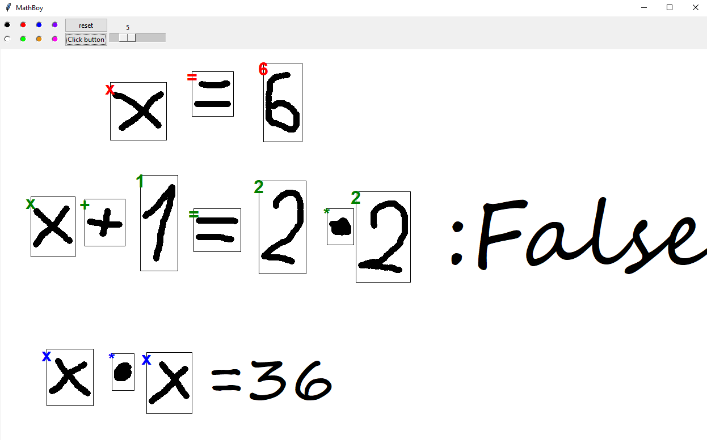

Mathboy
===
This is automatic math reader and solver. Inspired by Apple math notes.
It uses a convolutional neural network CNN to automaticly detect and classify math expressions.

It supports 3 types of mathematical expressions:
- Variable Assigment.
- Evaluating whether an expression is True or False.
- Calculating the value of an expression.

Example usage:

Datasets
---
I used two datasets as the first one didn't have equal sign which was essential for this project.
https://github.com/wblachowski/bhmsds -> for majority of characters\
https://www.kaggle.com/datasets/sagyamthapa/handwritten-math-symbols -> for equal sign "="
